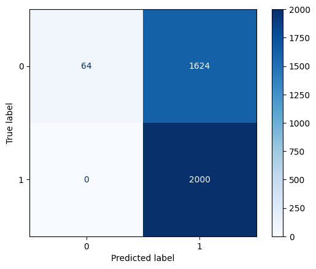
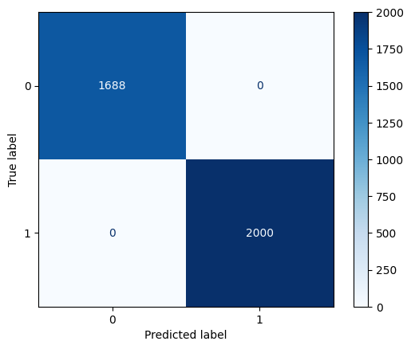
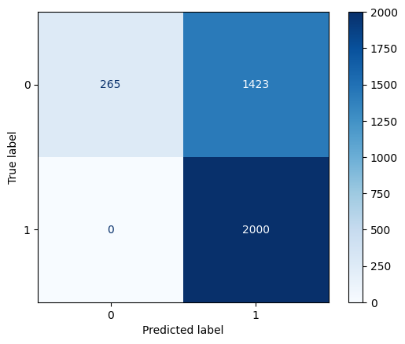
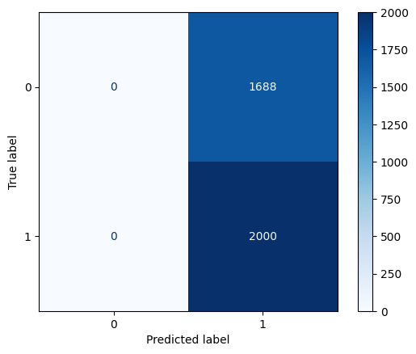
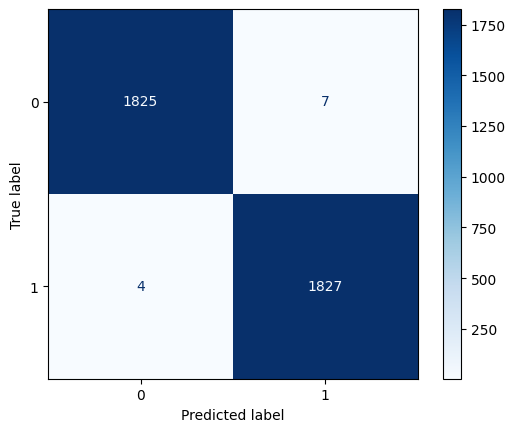
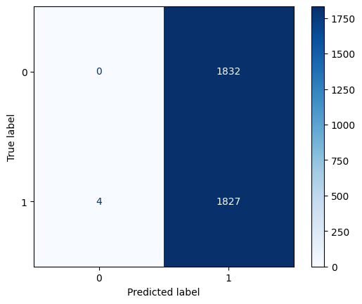

# Robustness Evaluation On IDS Evasion Attack: An Upgrade

## Description
Our project aims to build on the work of Ayub et al. (2020) and evaluate the robustness of using Jacobian-based Saliency Map Attack (JSMA) on machine learning-based intrution detection systems (IDS). 

Ayub et al. (2020) trained a multilayer perceptrons-based IDS using the CIC-IDS 2017 and TRAbID 2017 datasets and performed JSMA on the model. The results showed significant drops in model performances, indicating the effectiveness of JSMA. While this demonstrates the potential of the attack, the extent to which model complexity influences its success remains unclear. We aim to explore how robust JSMA can be on models with different complexity, extending prior work to evaluate its effectiveness under diverse model conditions.

Original work: [adversarial_ml_ids](https://github.com/TnTech-CEROC/adversarial_ml_ids/tree/master)  
Original paper: [Model Evasion Attack on Intrusion Detection Systems using Adversarial Machine Learning](https://ahsanayub.github.io/files/Authors_Copy_Model_Evasion_Attack_on_Intrusion_Detection_Systems_using_Adversarial_Machine_Learning.pdf)

## Our Work
The project is carried out in 3 phases.

**Phase 1:**
The primary goal of the project is to experiment JSMA on models with different complexity. Therefore, during this phase, different models are built and attacked, from which the results are derived and recorded to observe if there is a trend in the change of JSMA effectiveness.

**Phase 2:**
The orginal work by Ayub et al. (2020) used dataset CIC-IDS 2017, which contains substantial errors. To fix this, the [improved dataset](https://intrusion-detection.distrinet-research.be/CNS2022/index.html) published by Liu et al. (2022) is used.

**Phase 3:**
Any final adjustments to the project will be made in this phase.

In addition, while reimplementing the original codebase from Ayub et al.(2020), we addressed several issues with imported packages, data preprocessing, and JSMA implementation:
- TensorFlow is migrated from TF 1.x to TF 2.x and IBM’s Adversarial Robustness Toolbox (ART) is used to address compatibility problem in Google's Colab.
- The improved datasets are used in place of reimplementing experiments with CIC-IDS 2017 because the original data preprocessing code for CIC-IDS 2017 dataset does not match with the
dataset.
- Updated JSMA implementation using ART to address implementation inconsistencies and improve reproducibility.

## Datasets
TRAbID 2017 dataset:
- Training: 
- Testing: 1832 attack. 1831 benign.

CIC-IDS 2017 improved dataset: 1688 attack. 2000 benign. Some unimportant data are removed from this dataset. The original data contains 59.35 million benign and 3.84 million attack data in 10 csv files. We use a [python code](CSECICIDS2018_improved/read_csv.py) to extract the first 2000 benign and 2000 attack data, if applicatble, from each file.
- Training: 
- Testing: 

All numerical data are scaled to numbers between 0 and 1. 

## Models and Results
**1. The original MLP model includes two hidden layers with half of the feature number of neurons in each layer.**
Model performance with the TRAbID 2017 dataset: 

Attacked: 

Model performance with the CIC-IDS 2017 improved dataset: 

Attacked: 

**2. MLP model with three hidden layers**
Model performance with the TRAbID 2017 dataset: 

Attacked: 

Model performance with the CIC-IDS 2017 improved dataset: 

Attacked: 

**3. MLP model with four hidden layers**
Model performance with the TRAbID 2017 dataset: 

Attacked: 

Model performance with the CIC-IDS 2017 improved dataset: 

Attacked: 

**4. MLP model with two hidden layer and 64 neurons in each layer**
Model performance with the TRAbID 2017 dataset: 

Attacked: 

Model performance with the CIC-IDS 2017 improved dataset: 

Attacked: 

**5. MLP model with three hidden layer and 64 neurons in each layer**

Attacked: 

Model performance with the CIC-IDS 2017 improved dataset:

Attacked: 

**6. MLP model with four hidden layer and 64 neurons in each layer**

Attacked: 

Model performance with the CIC-IDS 2017 improved dataset: 

Attacked: 

## Working Environment
* Platform:                             Google Colab (Jupyter notebook environment)
* Python:                               3.12.12
* Adversarial-robustness-toolbox (ART): 1.20.1
* Keras:                                3.10.0
* Matplotlib:                           3.10.0
* Numpy:                                2.0.2
* Pandas:                               2.2.2
* Scikit-learn:                         1.6.1
* Tensorflow:                           2.19.0
